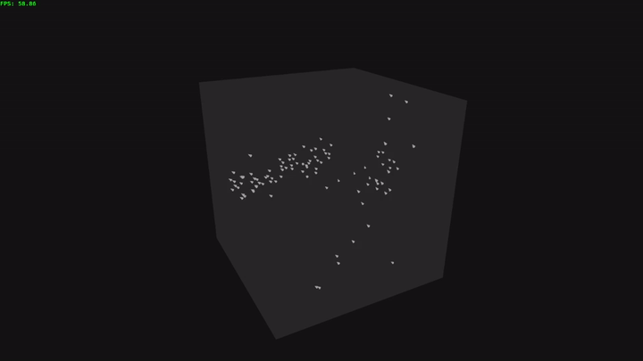

# Boids
Boids is a flocking simulation inspired by the work of Craig Reynolds. This simulation demonstrates how simple rules can lead to complex, emergent group dynamics among numerous bird like objects ("*boids*").

<!--  -->


## Getting Started

1. Clone the repository:
    ```bash
    git clone https://github.com/zro404/boids.git
    cd boids
    ```
2. Run the simulation:
    ```bash
    cargo run --release
    ```

## How It Works

Each boid follows three basic rules:
- **Separation:** Avoid crowding neighbors.
- **Alignment:** Steer towards the average heading of neighbors.
- **Cohesion:** Move towards the average position of neighbors.

## License

This project is licensed under the MIT License.